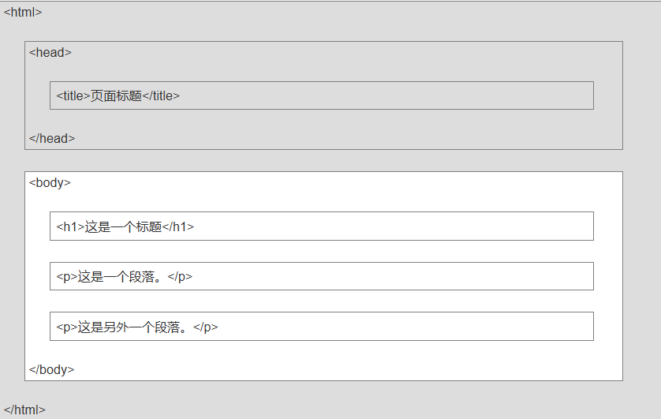

# 介绍
本篇仅为本人学习ctf的经验分享以及笔记保存，可能低效可能高效，互相尊重
 <button herf="note02.md">这个是翻页键</button>

## html、css、js
能够写出简单表单，能够通过js获取DOM元素，控制DOM树即可
### html
##### 2025.3.11

<p>这是一个段落(paragraph)</p>

网页结构如下


提示：目前在大部分浏览器中，直接输出中文会出现中文乱码的情况，这时候我们就需要在头部将字符声明为 UTF-8 或 GBK

```
<!DOCTYPE html>//声明文档类型
<html>

<head>
<meta charset="UTF-8">//字符解析类型
<title>标题</title>
</head>

<body>
<h1>标题</h1>
<p>段落</p>
</body>

</html>
```
<hr>

#### 基础
标题（数字tag可以从1打到6）

`<h1>这个是标题</h1>`


段落

`<p>这个是段落</p>`

链接

`<a href="https://www.4399.com">这个是链接</a>`

<a href="https://www.4399.com">这个是链接</a>

图像

``
实际为

相当于

