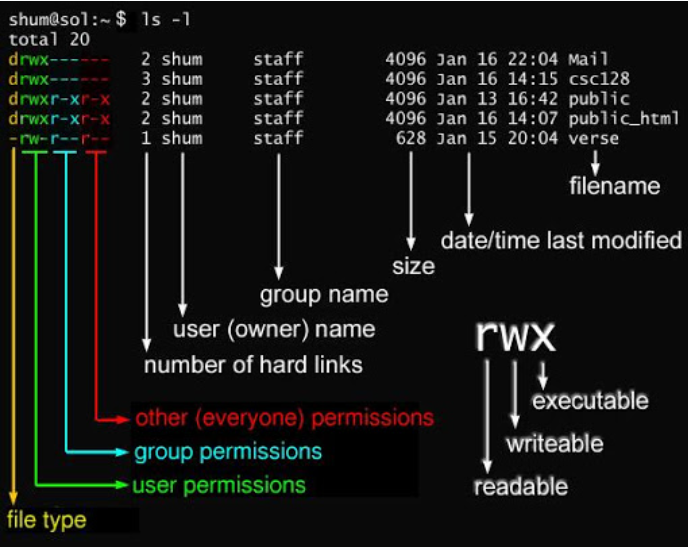

# 系统目录结构


- **/bin**

    bin 是 Binaries (二进制文件) 的缩写, 这个目录存放着最经常使用的命令。

- /boot

    这里存放的是启动 Linux 时使用的一些核心文件，包括一些连接文件以及镜像文件。

- /dev

  dev 是 Device(设备) 的缩写, 该目录下存放的是 Linux 的外部设备，在 Linux 中访问设备的方式和访问文件的方式是相同的。

- /etc

  etc 是 Etcetera(等等) 的缩写,这个目录用来存放所有的系统管理所需要的配置文件和子目录。

- /home

  用户的主目录，在 Linux 中，每个用户都有一个自己的目录，一般该目录名是以用户的账号命名的，如上图中的 alice、bob 和 eve。

- /lib

  lib 是 Library(库) 的缩写这个目录里存放着系统最基本的动态连接共享库，其作用类似于 Windows 里的 DLL 文件。几乎所有的应用程序都需要用到这些共享库。

- /lost+found

  这个目录一般情况下是空的，当系统非法关机后，这里就存放了一些文件。

- /media

  linux 系统会自动识别一些设备，例如U盘、光驱等等，当识别后，Linux 会把识别的设备挂载到这个目录下。

- /mnt

  系统提供该目录是为了让用户临时挂载别的文件系统的，我们可以将光驱挂载在 /mnt/ 上，然后进入该目录就可以查看光驱里的内容了。

- /opt

  opt 是 optional(可选) 的缩写，这是给主机额外安装软件所摆放的目录。比如你安装一个ORACLE数据库则就可以放到这个目录下。默认是空的。

- /proc

  proc 是 Processes(进程) 的缩写，/proc 是一种伪文件系统（也即虚拟文件系统），存储的是当前内核运行状态的一系列特殊文件，这个目录是一个虚拟的目录，它是系统内存的映射，我们可以通过直接访问这个目录来获取系统信息。

  这个目录的内容不在硬盘上而是在内存里，我们也可以直接修改里面的某些文件，比如可以通过下面的命令来屏蔽主机的ping命令，使别人无法ping你的机器：

`echo 1 > /proc/sys/net/ipv4/icmp_echo_ignore_all`

- /root

  该目录为系统管理员，也称作超级权限者的用户主目录。

- **/sbin**

  s 就是 Super User 的意思，是 Superuser Binaries (超级用户的二进制文件) 的缩写，这里存放的是系统管理员使用的系统管理程序。

- /selinux

   这个目录是 Redhat/CentOS 所特有的目录，Selinux 是一个安全机制，类似于 windows 的防火墙，但是这套机制比较复杂，这个目录就是存放selinux相关的文件的。

- /srv

   该目录存放一些服务启动之后需要提取的数据。

- /sys

  这是 Linux2.6 内核的一个很大的变化。该目录下安装了 2.6 内核中新出现的一个文件系统 sysfs 。

  sysfs 文件系统集成了下面3种文件系统的信息：针对进程信息的 proc 文件系统、针对设备的 devfs 文件系统以及针对伪终端的 devpts 文件系统。


- /tmp

  tmp 是 temporary(临时) 的缩写这个目录是用来存放一些临时文件的。

- /usr

 usr 是 unix system resources(unix 系统资源) 的缩写，这是一个非常重要的目录，用户的很多应用程序和文件都放在这个目录下，类似于 windows 下的 program files 目录。

- **/usr/bin**

  系统用户使用的应用程序。

- **/usr/sbin**

  超级用户使用的比较高级的管理程序和系统守护程序。

- /usr/src

  内核源代码默认的放置目录。

- **/var**

  var 是 variable(变量) 的缩写，这个目录中存放着在不断扩充着的东西，我们习惯将那些经常被修改的目录放在这个目录下。包括各种日志文件。

- /run

  是一个临时文件系统，存储系统启动以来的信息。当系统重启时，这个目录下的文件应该被删掉或清除。如果你的系统上有 /var/run 目录，应该让它指向 run。


# 文件基本属性

> 为了保护系统的安全性，Linux 系统对不同的用户访问同一文件（包括目录文件）的权限做了不同的规定。

`ll` 或者 `ls –l`

在 Linux 中通常使用以下两个命令来修改文件或目录的所属用户与权限：

- chown (change owner) ： 修改所属用户与组。

- chmod (change mode) ： 修改用户的权限。

***

**bin 文件属性**

|kind|对应|
|-|-|
|d|目录|
|-|文件|
|l|连接文档(link file)|
|b|装置文件里面的可供储存的接口设备(可随机存取装置)|
|c|装置文件里面的串行端口设备，例如键盘、鼠标(一次性读取装置)|

读写类型

|kind|对应|
|-|-|
|r|可读|
|w|可写|
|x|可执行|
|-|无权限|


接下来的字符中，以三个为一组，且均为 rwx 的三个参数的组合。其中， r 代表可读(read)、 w 代表可写(write)、 x 代表可执行(execute)。

这三个权限的位置不会改变，如果没有权限，就会出现减号 -




### Linux文件属主和属组

>对于文件来说，它都有一个特定的**所有者**，也就是对该文件具有所有权的用户。

>同时，在Linux系统中，**用户是按组分类的**，一个用户属于一个或多个组。

文件所有者以外的用户又可以分为文件所属组的同组用户和其他用户。

**Linux系统按文件所有者、文件所有者同组用户和其他用户来规定了不同的文件访问权限。**

对于 root 用户来说，一般情况下，文件的权限对其不起作用。


### 更改文件属性

#### chgrp
>更改文件属组

`chgrp [-R] 属组名 文件名`

-R：递归更改文件属组，就是在更改某个目录文件的属组时，如果加上 -R 的参数，那么该目录下的所有文件的属组都会更改。

#### chown
>更改文件所有者（owner），也可以同时更改文件所属组。
语法：

`chown [–R] 所有者 文件名`
`chown [-R] 所有者:属组名 文件名`

进入 /root 目录（~）将install.log的拥有者改为bin这个账号：

```
[root@www ~] cd ~
[root@www ~]# chown bin install.log
[root@www ~]# ls -l
-rw-r--r--  1 bin  users 68495 Jun 25 08:53 install.log
```
将install.log的拥有者与群组改回为root：
```
[root@www ~]# chown root:root install.log
[root@www ~]# ls -l
-rw-r--r--  1 root root 68495 Jun 25 08:53 install.log
```
####  chmod

> Linux文件的基本权限有九个，分别是 owner/group/others(拥有者/组/其他) 三种身份各有自己的 read/write/execute 权限

可以用数字代表权限 4 2 1——rwx，代指三组的权限数字

` chmod [-R] xyz 文件或目录`

- xyz : 刚刚提到的数字类型的权限属性，为 rwx 属性数值的相加。
- -R : 进行递归(recursive)的持续变更，以及连同次目录下的所有文件都会变更

```
[root@www ~]# ls -al .bashrc
-rw-r--r--  1 root root 395 Jul  4 11:45 .bashrc
[root@www ~]# chmod 777 .bashrc
[root@www ~]# ls -al .bashrc
-rwxrwxrwx  1 root root 395 Jul  4 11:45 .bashrc
```


`chmod u=rwx,g=rx,o=r`

- user：用户
- group：组
- others：其他


  - \+ add
  - \- delete
  - = set

可以使用 u, g, o 来代表三种身份的权限。

此外， a 则代表 all，即全部的身份。读写的权限可以写成 r, w, x，也就是可以使用下表的方式来看：

```
#  touch test1    // 创建 test1 文件
# ls -al test1    // 查看 test1 默认权限
-rw-r--r-- 1 root root 0 Nov 15 10:32 test1
# chmod u=rwx,g=rx,o=r  test1    // 修改 test1 权限
# ls -al test1
-rwxr-xr-- 1 root root 0 Nov 15 10:32 test1
```
```
#  chmod  a-x test1
# ls -al test1
-rw-r--r-- 1 root root 0 Nov 15 10:32 test1
```

# 文件与目录管理
>Linux 的目录结构为树状结构，最顶级的目录为根目录 /。

>其他目录通过挂载可以将它们添加到树中，通过解除挂载可以移除它们。

### 路径

绝对路径

路径的写法，由根目录` / `写起 ,`/usr/share/doc`

相对路径

路径的写法，不是由` / `写起，由` /usr/share/doc` 要到` /usr/share/man `底下时，可以写成： `cd ../man `

## 处理目录的常用命令

| 命令 | 功能描述 | 说明 |
|------|----------|------|
| ls | 列出目录及文件名 | list files |
| cd | 切换目录 | change directory |
| pwd | 显示目前的目录 | print work directory |
| mkdir | 创建一个新的目录 | make directory |
| rmdir | 删除一个空的目录 | remove directory |
| cp | 复制文件或目录 | copy file |
| rm | 删除文件或目录 | remove |
| mv | 移动文件与目录，或修改文件与目录的名称 | move file |

### ls
>Linux系统当中， ls 命令可能是最常被运行的。
`ls`（list files）是 Linux 和类 Unix 系统中用于列出目录内容的常用命令。它可以帮助用户查看当前目录或指定目录中的文件和子目录的详细信息。以下是关于 `ls` 命令的详细介绍：

```
ls [选项] [目录或文件]
```

如果路径中包含空格或特殊字符，需要用引号括起来


#### 常用选项
| 选项 | 功能描述 |
|------|----------|
| `-a` | 列出所有文件和目录（包括以`.`开头的隐藏文件和目录） |
| `-l` | 以长格式显示文件和目录的详细信息，包括权限、所有者、大小和修改时间等 |
| `-d` | 仅显示目录本身，而不是目录中的内容 |
| `-h` | 与 `-l` 选项结合使用，以更易读的格式显示文件大小（例如，以 KB、MB、GB 显示） |
| `-t` | 按修改时间排序，最近修改的文件或目录显示在前面 |
| `-r` | 以逆序方式显示文件和目录 |
| `-R` | 递归显示指定目录下的所有子目录和文件 |
| `-S` | 按文件大小排序 |

实际使用可以采用多个字符组合

eg.`[root@www ~]# ls -al ~`

### cd
>cd是Change Directory的缩写，这是用来变换工作目录的命令。

` cd [相对路径或绝对路径]`

如果不带参数，cd 会切换到当前用户登录时的主目录（通常是` /home/username`

eg
```
//使用绝对路径切换到 runoob 目录
[root@www ~]# cd /root/runoob/

//使用相对路径切换到 runoob 目录
[root@www ~]# cd ./runoob/

//表示回到自己的家目录，亦即是 /root 这个目录
[root@www runoob]# cd ~

//表示去到目前的上一级目录，亦即是 /root 的上一级目录的意思；
[root@www ~]# cd ..
```

**权限问题**

如果没有权限访问目标目录，cd 命令会报错，提示权限不足。

可以使用 sudo 命令获取超级用户权限，但通常不推荐直接用 sudo cd，因为 cd 是一个 shell 内置命令，不会改变当前用户的权限。


### pwd
>显示目前所在目录的命令。

`[root@www ~]# pwd [-P]`

选项与参数：

-P ：显示出确实的路径，而非使用链接 (link) 路径。

实例：单纯显示出目前的工作目录：
```
[root@www ~]# pwd
/root   <== 显示出目录啦～
```
实例显示出实际的工作目录，而非链接档本身的目录名而已。
```
[root@www ~]# cd /var/mail   //注意，/var/mail是一个链接档
[root@www mail]# pwd
/var/mail         //列出目前的工作目录
[root@www mail]# pwd -P
/var/spool/mail   
[root@www mail]# ls -ld /var/mail
lrwxrwxrwx 1 root root 10 Sep  4 17:54 /var/mail -> spool/mail

# 因为 /var/mail 是链接档，链接到 /var/spool/mail
# -P 会不以链接档的数据显示，而是显示正确的完整路径
```

### mkdir
>创建新目录

`mkdir [-mp] 目录名称`

- -m ：配置文件的权限,直接配置，不需要看默认权限 (umask) 的脸色
- -p ：帮助你直接将所需要的目录(包含上一级目录)递归创建起来

实例：到/tmp底下尝试创建数个新目录
```
[root@www ~]# cd /tmp
[root@www tmp]# mkdir test    <==创建一名为 test 的新目录
[root@www tmp]# mkdir test1/test2/test3/test4
mkdir: cannot create directory `test1/test2/test3/test4':
No such file or directory       <== 没办法直接创建此目录啊！
[root@www tmp]# mkdir -p test1/test2/test3/test4

```

加了 -p ，可以自行帮你创建多层目录

实例：创建权限为 rwx--x--x 的目录。
```
[root@www tmp]# mkdir -m 711 test2
[root@www tmp]# ls -l
drwxr-xr-x  3 root  root 4096 Jul 18 12:50 test
drwxr-xr-x  3 root  root 4096 Jul 18 12:53 test1
drwx--x--x  2 root  root 4096 Jul 18 12:54 test2
```
上面的权限部分，如果没有加上 -m 来强制配置属性，系统会使用默认属性。

如果我们使用 -m ，如上例我们给予 -m 711 来给予新的目录 drwx--x--x 的权限。


### cp

>`cp`（copy）是 Linux 和类 Unix 系统中用于复制文件和目录的命令。它可以帮助用户将一个或多个文件或目录从一个位置复制到另一个位置。以下是关于 `cp` 命令的详细介绍：

基本语法

```
cp [选项] 源文件或目录 目标文件或目录
```

常用选项

| 选项 | 功能描述 |
|------|----------|
| `-i` | 在覆盖目标文件之前提示用户确认（interactive） |
| `-r` 或 `-R` | 递归复制目录及其内容（recursive） |
| `-p` | 保留文件的权限、所有者、时间戳等属性（preserve） |
| `-f` | 强制复制，覆盖目标文件时不提示（force） |
| `-v` | 显示复制过程的详细信息（verbose） |
| `-a` | 归档模式，相当于 `-dR --preserve=all`，递归复制并保留所有文件属性，类似于备份操作（archive） |

复制单个文件
```
cp file1.txt file2.txt
```
- 将 `file1.txt` 复制为 `file2.txt`。如果 `file2.txt` 已存在，会覆盖它。

复制多个文件到目标目录
```
cp file1.txt file2.txt /path/to/destination/
```
- 将 `file1.txt` 和 `file2.txt` 复制到指定的目标目录 `/path/to/destination/`。


```
cp -r directory1 /path/to/destination/
```
- 递归复制整个目录 `directory1` 及其所有内容到目标目录 `/path/to/destination/`。

保留文件属性
```
cp -p file1.txt /path/to/destination/
```
- 复制 `file1.txt` 到目标目录时，保留其权限、所有者和时间戳等属性。

强制覆盖目标文件
```
cp -f file1.txt file2.txt
```
- 强制覆盖目标文件 `file2.txt`，不提示用户确认。

归档模式复制
```
cp -a directory1 /path/to/destination/
```
- 使用归档模式递归复制整个目录 `directory1` 及其所有内容到目标目录，同时保留所有文件属性。

显示详细信息
```
cp -v file1.txt file2.txt
```
- 复制文件时显示详细信息，例如：
  ```
  'file1.txt' -> 'file2.txt'
  ```


**目标文件已存在**：
   - 如果目标文件已存在，且未使用 `-i` 选项，`cp` 默认会覆盖目标文件。
   - 使用 `-i` 选项可以在覆盖前提示用户确认。

**目录复制**：
   - 如果要复制目录，必须使用 `-r` 或 `-R` 选项，否则会报错。

**权限问题**：
   - 如果没有权限访问源文件或目录，或者没有权限写入目标目录，`cp` 命令会报错。
   - 可以使用 `sudo` 命令获取超级用户权限，但需要谨慎使用。

**符号链接**：
   - 默认情况下，`cp` 会复制符号链接指向的目标文件，而不是符号链接本身。
   - 如果需要复制符号链接本身，可以使用 `-d` 选项（`-a` 选项也包含此功能）。

###  rm
>移除文件或目录

    `rm [-fir] 文件或目录`

- -f ：就是 force 的意思，忽略不存在的文件，不会出现警告信息；
- -i ：互动模式，在删除前会询问使用者是否动作
- -r ：递归删除,常用在目录的删除！这是非常危险的选项！！！
   ```
   [root@www tmp]# rm -i bashrc
   rm: remove regular file `bashrc'? y
   ```
   如果加上 -i 的选项就会主动询问，避免删除到错误的档名

### mv
>移动文件与目录，或修改名称

   `[root@www ~]# mv [-fiu] source destination`
   `[root@www ~]# mv [options] source1 source2 source3 .... directory`
   选项与参数：

- -f ：force 强制的意思，如果目标文件已经存在，不会询问而直接覆盖；
- -i ：若目标文件 (destination) 已经存在时，就会询问是否覆盖！
- -u ：若目标文件已经存在，且 source 比较新，才会升级 (update)

   复制一文件，创建一目录，将文件移动到目录中
```
   [root@www ~]# cd /tmp
   [root@www tmp]# cp ~/.bashrc bashrc
   [root@www tmp]# mkdir mvtest
   [root@www tmp]# mv bashrc mvtest
   将某个文件移动到某个目录去，就是这样做！
```
   将刚刚的目录名称更名为 mvtest2

   `[root@www tmp]# mv mvtest mvtest2`

# Linux 文件内容查看

| 命令 | 功能描述 |
|------|----------|
| `cat` | 由第一行开始显示文件内容 |
| `tac` | 从最后一行开始显示|
| `nl`  | 显示的时候，顺道输出行号 |
| `more` | 一页一页的显示文件内容 |
| `less` | 与 `more` 类似，但可以往前翻页 |
| `head` | 只看头几行 |
| `tail` | 只看尾巴几行 |


### cat
>由第一行开始显示文件内容

`cat [-AbEnTv]`


- -A ：相当於 -vET 的整合选项，可列出一些特殊字符而不是空白而已；
- -b ：列出行号，仅针对非空白行做行号显示，空白行不标行号！
- -E ：将结尾的断行字节 $ 显示出来；
- -n ：列印出行号，连同空白行也会有行号，与 -b 的选项不同；
- -T ：将 [tab] 按键以 ^I 显示出来；
- - v ：列出一些看不出来的特殊字符
```
[root@www ~]# cat /etc/issue
CentOS release 6.4 (Final)
Kernel \r on an \m
```


### tac

反向的cat

### nl
>`nl` 是一个用于显示文件内容并同时输出行号的命令。

```
nl [-bnw] 文件
```

| 选项 | 功能描述 |
|------|----------|
| `-b` | 指定行号指定的方式，主要有两种： |
| `-b a` | 表示不论是否为空行，也同样列出行号（类似 `cat -n`） |
| `-b t` | 如果有空行，空的那一行不要列出行号（默认值） |
| `-n` | 列出行号表示的方法，主要有三种： |
| `-n ln` | 行号在屏幕的最左方显示 |
| `-n rn` | 行号在自己栏位的最右方显示，且不加 0 |
| `-n rz` | 行号在自己栏位的最右方显示，且加 0 |
| `-w` | 行号栏位的占用的位数 |


用 nl 列出 /etc/issue 的内容

```
[root@www ~]# nl /etc/issue
     1  CentOS release 6.4 (Final)
     2  Kernel \r on an \m
```

### more
>一页一页翻动

```
[root@www ~]# more /etc/man_db.config
#
# Generated automatically from man.conf.in by the
# configure script.
#
# man.conf from man-1.6d
....(中间省略)....
--More--(28%)  //重点在这一行喔！你的光标也会在这里等待你的命令

```

在 `more` 运行过程中，可以使用以下按键操作：

- 空白键 (space)：向下翻一页；
- Enter：向下翻一行；
- `/字串`：在这个显示的内容中向下搜索关键字“字串”；
- `:f`：立刻显示文件名及当前显示的行数；
- `q`：退出 `more`，不再显示文件内容；
- `b` 或 `[ctrl]-b`：往回翻页（仅对文件有效，对管道无用）。

### less
>一页一页翻动

以下实例输出 `/etc/man.config` 文件的内容：

```
[root@www ~]# less /etc/man.config
#
# Generated automatically from man.conf.in by the
# configure script.
#
# man.conf from man-1.6d
....(中间省略)....
:   //这里可以等待你输入命令
```

`less` 运行时可以输入的命令有：

- 空白键：向下翻动一页；
- `[pagedown]`：向下翻动一页；
- `[pageup]`：向上翻动一页；
- `/字串`：向下搜索“字串”；
- `?字串`：向上搜索“字串”；
- `n`：重复前一个搜索（与 `/` 或 `?` 相关）；
- `N`：反向重复前一个搜索（与 `/` 或 `?` 相关）；
- `q`：退出 `less` 程序。

### head

取出文件前面几行

```
head [-n number] 文件
```


- `-n`：后面接数字，表示显示几行。

```
[root@www ~]# head /etc/man.config
```
默认情况下，显示文件的前 10 行。若要显示前 20 行，可以这样：
```
[root@www ~]# head -n 20 /etc/man.config
```

### tail
>取出文件后面几行

```
tail [-n number] 文件
```


- `-n`：后面接数字，表示显示几行。
- `-f`：持续侦测后面所接的文件，直到按下 `[ctrl]-c` 才会结束。

```
[root@www ~]# tail /etc/man.config
```
默认情况下，显示文件的最后 10 行。若要显示最后 20 行，可以这样：
```
[root@www ~]# tail -n 20 /etc/man.config
```


## Linux 链接

Linux 链接分两种，一种被称为硬链接（Hard Link），另一种被称为符号链接（Symbolic Link）。默认情况下，`ln` 命令产生硬链接。

### 硬链接
硬链接是通过索引节点（inode）来进行连接的。

在 Linux 的文件系统中，保存在磁盘分区中的文件，无论是什么类型，都会被分配一个编号，称为索引节点号（Inode Index）。

在 Linux 中，多个文件名可以指向同一个索引节点。例如：`A` 是 `B` 的硬链接（`A` 和 `B` 都是文件名），则 `A` 的目录项中的 inode 节点号与 `B` 的目录项中的 inode 节点号相同，即一个 inode 节点对应两个不同的文件名，两个文件名指向同一个文件，`A` 和 `B` 对文件系统来说是完全平等的。删除其中任何一个都不会影响另一个的访问。

硬链接的作用是允许一个文件拥有多个有效路径名，这样用户就可以建立硬链接到重要文件，以防止“误删”的功能。其原因如上所述，因为对应目录的索引节点有一个以上的连接。只删除一个连接并不影响索引节点本身和其他的连接

**只有当最后一个连接被删除后，文件的数据块及目录的连接才会被释放。**

也就是说，文件真正删除的条件是与之相关的所有硬链接文件均被删除。

### 符号链接

另外一种连接被称为符号链接（Symbolic Link），也叫软链接。符号链接文件类似于 Windows 的快捷方式。它实际上是一个特殊的文件。在符号链接中，文件实际上是一个文本文件，其中包含另一个文件的位置信息。例如：`A` 是 `B` 的软链接（`A` 和 `B` 都是文件名），`A` 的目录项中的 inode 节点号与 `B` 的目录项中的 inode 节点号不相同，`A` 和 `B` 指向的是两个不同的 inode，继而指向两块不同的数据块。但是 `A` 的数据块中存放的只是 `B` 的路径名（可以根据这个找到 `B` 的目录项）。`A` 和 `B` 之间是“主从”关系，如果 `B` 被删除了，`A` 仍然存在（因为两个是不同的文件），但指向的是一个无效的链接。

### 实验
```
[oracle@Linux]$ touch f1          //创建一个测试文件 f1
[oracle@Linux]$ ln f1 f2          //创建 f1 的一个硬链接文件 f2
[oracle@Linux]$ ln -s f1 f3       //创建 f1 的一个符号链接文件 f3
[oracle@Linux]$ ls -li            //-i 参数显示文件的 inode 节点信息
total 0
9797648 -rw-r--r--  2 oracle oinstall 0 Apr 21 08:11 f1
9797648 -rw-r--r--  2 oracle oinstall 0 Apr 21 08:11 f2
9797649 lrwxrwxrwx  1 oracle oinstall 2 Apr 21 08:11 f3 -> f1
```
从上面的结果中可以看出，硬链接文件 `f2` 与原文件 `f1` 的 inode 节点相同，均为 `9797648`，然而符号链接文件的 inode 节点不同。

```
[oracle@Linux]$ echo "I am f1 file" >> f1
[oracle@Linux]$ cat f1
I am f1 file
[oracle@Linux]$ cat f2
I am f1 file
[oracle@Linux]$ cat f3
I am f1 file
[oracle@Linux]$ rm -f f1
[oracle@Linux]$ cat f2
I am f1 file
[oracle@Linux]$ cat f3
cat: f3: No such file or directory
```
通过上面的测试可以看出：当删除原始文件 `f1` 后，硬链接 `f2` 不受影响，但是符号链接 `f3` 文件无效。

### 总结

1. 删除符号链接 `f3`，对 `f1`、`f2` 无影响；
2. 删除硬链接 `f2`，对 `f1`、`f3` 也无影响；
3. 删除原文件 `f1`，对硬链接 `f2` 没有影响，但导致符号链接 `f3` 失效；
4. 同时删除原文件 `f1` 和硬链接 `f2`，整个文件会真正被删除。
