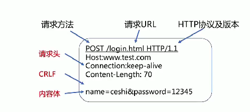
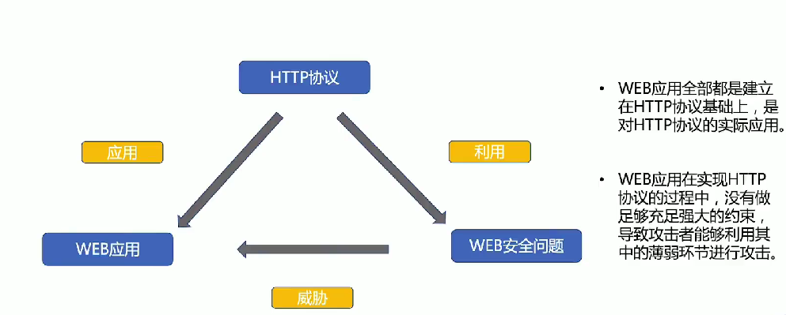

# 协议基础

## HTTP协议是怎么工作的

1. 客户端连接到web服务器
  http客户端(通常是浏览器)，与web服务器的HTTP端口(默认80)建立一个TCP套接字连接

2. 发送HTTP请求
  通过TCP套接字，client向server发送一个文本的请求报文(请求报文=请求行+请求头部+空行+请求数据)

3. 服务器接受请求并返回HTTP响应
  server解析请求，定位资源。服务器将资源复本写到TCP套接字(响应=状态行+请求头部+空行+响应数据)

4. 释放连接TCP连接
  if connection==close:
    服务器主动关闭连接，客户端被动关闭连接，释放TCP连接
  if connection==keepalive:
    连接保持一段世界，能够继续接收请求

5. 客户端浏览器解析HTML内容

常见类型：

| 特性         | GET请求                                      | POST请求                                      |
|--------------|---------------------------------------------|-----------------------------------------------|
| 参数传递方式 | 参数直接拼接在URL后面                        | 参数放在请求体里面                           |
| 长度限制     | 有限制，一般不超过1024KB                    | 理论上没有长度限制，但浏览器一般有限制       |
| 安全性       | 数据明文显示在URL上，安全性和私密性较低     | 数据不会显示在URL中，相对更安全               |
| 数据包处理   | 产生一个数据包，header和data一并发送        | 产生两个数据包，先发送header，再发送data     |
| 幂等性       | 是，多次执行相同请求，资源状态不变          | 否，多次执行可能会有不同的结果               |
| 缓存         | 可以被缓存                                   | 不会被缓存                                   |
| 历史记录     | 保留在浏览器历史记录中                      | 不保留在浏览器历史记录中                     |
| 书签         | 可以被收藏为书签                            | 不能被收藏为书签                             |
| 用途         | 通常用于获取数据                            | 通常用于提交数据                             |

### http 请求方法

| 方法     | 说明               | 支持的 HTTP 协议版本 |
|----------|--------------------|----------------------|
| GET      | 获取资源           | 1.0, 1.1             |
| POST     | 传输实体主体       | 1.0, 1.1             |
| PUT      | 传输文件           | 1.0, 1.1             |
| HEAD     | 获取报文首部       | 1.0, 1.1             |
| DELETE   | 删除文件           | 1.0, 1.1             |
| OPTIONS  | 询问支持的方法     | 1.1                  |
| TRACE    | 追踪路径           | 1.1                  |
| CONNECT  | 要求用隧道协议连接代理 | 1.1                  |
| LINK     | 建立和资源之间的联系 | 1.0                  |
| UNLINK   | 断开连接关系       | 1.0                  |

### http响应码分类

| 类别 | 原因短语               |
|------|------------------------|
| 1XX  | Informational（信息性状态码） 接收的请求正在处理 |
| 2XX  | Success（成功状态码）    请求正常处理完毕     |
| 3XX  | Redirection（重定向状态码） 需要进行附加操作以完成请求 |
| 4XX  | Client Error（客户端错误状态码） 服务器无法处理请求 |
| 5XX  | Server Error（服务器错误状态码） 服务器处理请求出错 |

## Web 安全溯源

## WEB安全攻防要点

### 客户端脚本安全
- 浏览器安全
- 跨站脚本攻击 (XSS)
  - 反射型
  - 存储型
  - DOM型
- 跨站点请求伪造 (CSRF)
- 点击劫持 (ClickJacking)
- 网页钓鱼

### 服务端应用安全
- 认证与会话管理
- 访问控制
- 加密算法安全
- SQL注入攻击
  - GET注入
  - POST注入
  - HTTP头注入
- 文件上传漏洞
- Web框架漏洞
- 拒绝服务攻击（应用层 传输层）
- 开发语言安全
  - 文件包含漏洞
  - 变量覆盖漏洞
  - 代码执行漏洞
- Web Server 配置安全
  - 远程命令执行

### 业务逻辑安全

### 为什么会诞生问题？

  前端输入不可信，web应用在实现http协议中没有做足够强大的约束
