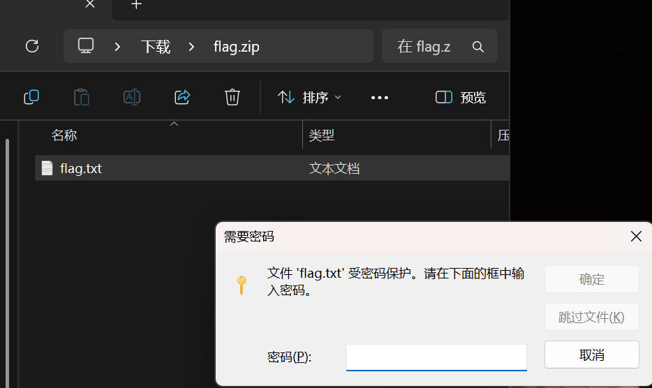
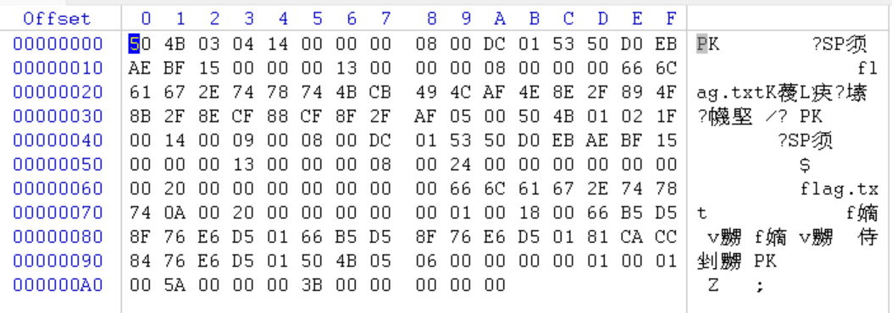

# 解题记录

## 杂项1
```
小明想给心爱的妹子表白很久，可是不知道怎么开口，你能帮帮小明吗？
已知 md5(表白的话+ctf)=ed400fbcff269bd9c65292a97488168a
提交flag{表白的话}
```

[解密md5](https://www.somd5.com/)

### md5
Message Digest Algorithm，一种被广泛使用的密码散列函数，可以产生出一个 128 bit 的散列值（hash value），用于确保信息传输完整一致

作用：

（一）密码加密

用户注册账号设置密码时，系统不会直接将明文密码存储在数据库中，而是先对密码进行 MD5 加密，再将加密后的哈希值存储起来。

用户登录时，输入密码后，系统会对输入的密码再次进行 MD5 加密，然后将新生成的哈希值与数据库中存储的哈希值进行比对。如果两者一致，说明密码正确，允许用户登录；反之，则拒绝登录。

（二）文件完整性验证

在文件传输、下载等场景中，MD5 加密算法用于验证文件是否被篡改。

在数据备份与恢复过程中，MD5 也可用于验证备份文件的完整性。对原始数据进行 MD5 计算得到一个哈希值，在恢复数据时，对恢复后的文件再次计算 MD5 值，通过比较两个哈希值，能判断恢复的数据是否与原始数据一致。

（三）数字签名

假设一家公司要通过网络向合作伙伴发送一份重要的电子合同，为了保证合同在传输过程中不被篡改，且发送方无法否认发送过该合同，就会用到 MD5 和数字签名技术。

首先，发送方使用 MD5 算法对电子合同内容进行计算，生成一个 MD5 哈希值。然后，发送方使用自己的私钥对这个哈希值进行加密，得到数字签名。接着，发送方将电子合同和数字签名一起发送给接收方。接收方收到后，使用发送方的公钥对数字签名进行解密，得到一个哈希值。同时，接收方也对收到的电子合同使用 MD5 算法计算哈希值。如果两个哈希值相同，说明合同在传输过程中没有被篡改，且确实是由声称的发送方发送的，从而保证了数据的完整性和不可抵赖性 。

六、MD5 加密算法的安全性探讨

（一）存在的安全隐患

在实际应用中，常见的破解 MD5 算法的方法有多种。其中，暴力破解法是一种较为简单直接的方式，它通过穷举所有可能的字符组合，计算其 MD5 值，然后与目标 MD5 值进行比对，直至找到匹配的结果。

字典法也是一种常用的破解手段。黑客们会预先建立一个包含大量常见密码及其 MD5 值的字典。当获取到目标 MD5 值后，他们会在字典中查找是否有与之匹配的记录。如果目标密码恰好是字典中已有的常见密码，那么就能快速实现破解。例如，很多用户为了方便记忆，会使用生日、电话号码、简单单词等作为密码，这些密码很容易被收录在字典中，从而增加了被破解的风险。

彩虹表法是一种更为高效的破解方法。它是对字典法的优化，通过预先计算大量哈希值与对应的明文值的映射关系，并存储在特定的数据结构中。在破解 MD5 哈希值时，利用彩虹表可以快速定位可能的明文，大大提高了破解效率。彩虹表的构建需要占用大量的存储空间，但其破解速度非常快，对 MD5 加密的安全性构成了严重威胁。

（二）应对措施

为了增强 MD5 加密的安全性，可以采取多种有效的应对方法。

加盐（Salting）是一种常用且有效的手段。在对原始数据进行 MD5 加密之前，先添加一个随机生成的字符串（即 “盐”），然后将加盐后的数据进行 MD5 加密。由于盐值是随机的，并且与原始数据一起存储，这就使得即使两个用户使用了相同的密码，经过加盐加密后的结果也会截然不同。例如，用户 A 和用户 B 的密码都是 “password”，如果没有加盐，他们密码的 MD5 值是相同的。但在添加不同的盐值后，如用户 A 的盐值为 “salt1”，用户 B 的盐值为 “salt2”，那么对 “passwordsalt1” 和 “passwordsalt2” 进行 MD5 加密，得到的结果完全不同。这样一来，攻击者就无法通过预先计算的彩虹表或字典来快速破解密码，大大增加了破解的难度。

多次加密也是提升安全性的一种方式。对原始数据进行一次 MD5 加密后，再对加密结果进行多次 MD5 加密。例如，先对密码 “123456” 进行 MD5 加密，得到一个哈希值，然后再对这个哈希值进行 MD5 加密，甚至可以进行更多轮的加密。经过多次加密后，加密结果的复杂度大幅提高，攻击者想要破解就需要付出更多的计算资源和时间。但需要注意的是，多次加密也会增加计算的开销，在实际应用中需要根据具体情况权衡安全性和性能之间的关系。

除了上述方法，还可以结合其他加密算法来进一步保障数据的安全。例如，在一些对安全性要求极高的场景中，可以先使用 MD5 算法对数据进行初步加密，然后再使用更为安全的 SHA - 256 等算法进行二次加密。这样多重加密的方式，使得攻击者需要面对多个加密层次的挑战，极大地提高了数据的安全性。同时，在实际应用中，应加强对用户密码设置的要求，鼓励用户设置复杂的密码，包含大小写字母、数字和特殊字符等，并定期更换密码，以降低被破解的风险。


## 杂项2

`小明终于找到了萌新码，开始了自己的CTF冒险征程`

使用winhex打开拉到最后即可

### winhex 介绍

Winhex是使用最多的一款工具软件，是在Windows下运行的十六进制编辑软件，此软件功能非常强大，有完善的分区管理功能和文件管理功能，能自动分析分区链和文件簇链，能对硬盘进行不同方式不同程度的备份，甚至克隆整个硬盘；它能够编辑任何一种文件类型的二进制内容（用十六进制显示）其磁盘编辑器可以编辑物理磁盘或逻辑磁盘的任意扇区，是手工恢复数据的首选工具软件。

用法1：查看内容/txt编码

## 杂项4
```
小明如愿以偿的打开了压缩包，可是眼前的文字自己只能认识FBI，其他的都不认识，而且屏幕出现了一句话，你能帮小明找到这句话的意思吗？

FBI    No under 18

i was always Fond of visiting new scenes, and observing strange characters and manners. even when a mere chiLd i began my travels, and made mAny tours of discovery into foreiGn {parts and unknown regions of my native City, to the frequent alarm of my parents, and The emolument of the town-crier. as i grew into boyhood, i extended the range oF my obServations. my holiday afternoons were spent in rambles about tHe surrounding cOuntry. i made myself familiar With all its places famous in history or fable. i kNew every spot where a murder or robbery had been committed, or a ghost seen. i visited the neighboring villages, and added greatly to my stock of knowledge,By noting their habits and customs, and conversing with their sages and great men.}
```

经典隐写，把所有大写单独提取出来，得到flag


## 杂项6

```
小明的压缩包又忘记密码了？他去电脑维修店去修，人家扔出来说这个根本就没有密码，是个假密码。小明懵了，明明有密码的啊，你能帮帮小明吗？
```



发现是伪加密，打开winhex修改即可

### zip文件

一个 ZIP 文件由三个部分组成：

压缩源文件数据区+压缩源文件目录区+压缩源文件目录结束标志



第一行

`50 4B 03 04 14 00 00 00 08 00 DC 01 53 50` `D0 EB`

`AE BF 15 00 00 00 13 00 00 00 08 00 00 00 66 6C`

`61 67 2E 74 78 74 4B CB 49 4C AF 4E 8E 2F 89 4F`

第四行

`8B 2F 8E CF 88 CF 8F 2F AF 05 00`

 `50 4B 01 02 1F`

`00 14 00 09 00 08 00 DC 01 53 50 D0 EB AE BF 15`

`00 00 00 13 00 00 00 08 00 24 00 00 00 00 00 00`

`00 20 00 00 00 00 00 00 00 66 6C 61 67 2E 74 78`

`74 0A 00 20 00 00 00 00 00 01 00 18 00 66 B5 D5`

`8F 76 E6 D5 01 66 B5 D5 8F 76 E6 D5 01 81 CA CC`

第十行

`84 76 E6 D5 01``50 4B 05 06 00 00 00 00 01 00 01`

`00 5A 00 00 00 3B 00 00 00 00 00`

a：压缩源文件数据区
b：压缩源文件目录区
c：压缩源文件结束标志

|数据区|代码范围|作用|
|---|--|--|
|a|`50 4B 03 04`|头文件标记（0x04034b50）|
|a|`00 00`|解压文件所需要的pkware版本|
|a|`00 00`|全局方式位标记（判断有无加密）|
|a|`08 00`|压缩方式|
|a|`DC 01`|最后修改文件时间|
|a|`53 50`|最后修改文件日期|

|数据区|代码范围|作用|
|---|--|--|
|b|`50 4B 01 02`|头文件标记（0x04034b50）|
|b|`1F 00`|压缩文件所需要的pkware版本|
|b|`14 00`|解压文件所需要的pkware版本|
|b|`09 00`|全局方式位标记（判断是否为伪加密）|
|b|`08 00`|压缩方式|
|b|`DC 01`|最后修改文件时间|
|b|`53 50`|最后修改文件日期|

|数据区|代码范围|作用|
|---|--|--|
|c|`50 4B 05 06`|目录结束标记|
|c|`00 00`|当前磁盘编号|
|c|`00 00`|目录区开始磁盘编号|
|c|`01 00`|本磁盘上纪录总数|
|c|`01 00`|目录区中纪录总数|
|c|`5A 00 00 00`|目录区尺寸大小|
|c|`3B 00 00 00`|目录区对第一张磁盘的偏移量|
|c|`00 00`|ZIP 文件注释长度|


**如何判断是否加密**

全局方式位标记的四个数字中只有第二个数字对其有影响，其它的不管为何值，都不影响它的加密属性，即：
                                             第二个数字为奇数时 –>加密
                                             第二个数字为偶数时 –>未加密


|类型|a区全局方式位标记|b区全局方式位标记|
|--|--|--|
|无加密|`00 00`|`00 00`|
|伪加密|`00 00`|`09 00`|
|真加密|`09 00`|`09 00`|

有些伪加密会采用两个`09 00`欺骗，其实可以先复制一份硬着头皮修改试试

### 常见头文件

|文件类型| 文件头|
|--|--|
|jpg|`FF D8 FF E1 `|
|png|`89 50 4E 47`|
|gif|`47 49 46 38`|
|tiff|`49 49 2A 00`|
|windows bitmap|`42 4D C0 01`|
|zip archive|`50 4B 03 04`|
|rar archive|`52 61 72 21`|
|psd|`38 42 50 53`|
|rich text format|`7B 5C 72 74 66`|
|xml|`3C 3F 78 6D 6C`|
|html|`78 94 6D 6C 3E`|
|pdf|`25 50 44 46 2D 31 2E`|
|wave|`57 41 56 45`|
|pcap|`4D 3C 2B 1A`|

### jpg

#### 段的一般结构

|名称|字节数|数据|说明|
|----|-----|-----|---|
|段标识|1 |`FF`|每个新段的开始标识|
|段类型|1|| 类型编码（称作“标记码”）|
|段长度|2|| 包括段内容和段长度本身,不包括段标识和段类型|
|段内容 |||≤65533字节|

说明：
1. JPG 文件中所有关于宽度高度长度间隔这一类数据，凡是＞１字节的，均采用Motorola格式，即：高位在前，低位在后。
2. 有些段没有长度描述也没有内容，只有段标识和段类型。文件头和文件尾均属于这种段。
3. 段与段之间无论有多少FF都是合法的，这些FF称为“填充字节”，必须被忽略掉。

#### 段类型

|名称|标记码|说明|
|---|-----|-----|
|SOI|`D8`|文件头|
|EOI|`D9`|文件尾|
|SOF0|`C0`|帧开始（标准 JPEG）|
|SOF1|`C1`|同上|
|DHT|`C4`|定义 Huffman 表（霍夫曼表）|
|SOS|`DA`|扫描行开始|
|DQT|`DB`|定义量化表|
|DRI|`DD`|定义重新开始间隔|
|APP0|`E0`|定义交换格式和图像识别信息|
|COM|`FE`|注释|

说明：
1. 有的文章也将DNL段（标记码＝DC，定义扫描行数）列为必须段。

以下是按照Markdown格式调整后的文本内容：

**SOI（文件头）**
| 名称     | 字节数 | 值  |
|----------|--------|-----|
| 段标识   | 1      | FF  |
| 段类型   | 1      | D8  |

**说明**：这两个字节构成了JPEG文件头。

**APP0（图像识别信息）**

| 名称       | 字节数 | 值          | 说明 |
|------------|--------|-------------|------|
| 段标识     | 1      | FF          |      |
| 段类型     | 1      | E0          |      |
| 段长度     | 2      | 0010        | 如果有RGB缩略图就=16+3n |
| 交换格式   | 5      | 4A46494600  | “JFIF”的ASCII码 |
| 主版本号   | 1      |             |      |
| 次版本号   | 1      |             |      |
| 密度单位   | 1      |             | 0=无单位；1=点数/英寸；2=点数/厘米 |
| X像素密度  | 2      |             | 水平方向的密度 |
| Y像素密度  | 2      |             | 垂直方向的密度 |
| 缩略图X像素| 1      |             | 缩略图水平像素数目 |
| 缩略图Y像素| 1      |             | 缩略图垂直像素数目 |
| RGB缩略图  | 3×n    |             | n=缩略图像素总数=缩略图X像素×缩略图Y像素 |

**说明**：

1. JFIF是JPEG File Interchange Format的缩写，即JPEG文件交换格式，另外还有TIFF等格式，很少用。
2. “如果有RGB缩略图就=16+3n”是什么意思呢？比如说“缩略图X像素”和“缩略图Y像素”的值均为48，就表示有一个48×48像素的缩略图（n=48×48），缩略图是24位真彩位图，用3个字节来表示一个像素，所以共占用3n个字节。但大多数JPG文件都没有这个“鸡肋”缩略图。

**COM（注释）**

| 名称     | 字节数 | 值  | 说明 |
|----------|--------|-----|------|
| 段标识   | 1      | FF  |      |
| 段类型   | 1      | FE  |      |
| 段长度   | 2      |     | 其值=注释字符的字节数+2 |
| 段内容   |        |     | 注释字符 |

**说明**：有的JPEG文件没有这个段。
以下是按照Markdown格式调整后的文本内容：

**DQT（定义量化表）**

| 名称    | 字节数 | 值  | 说明 |
|---------|--------|-----|------|
| 段标识  | 1      | FF  |      |
| 段类型  | 1      | DB  |      |
| 段长度  | 2      | 43  | 其值=3+n（当只有一个QT时） |
| QT信息  | 1      |     | 0-3位：QT号<br>4-7位：QT精度（0=8bit，1字节；否则=16bit，2字节） |
| QT      | n      |     | n=64×QT精度的字节数 |

**说明**：
1. JPEG文件一般有2个DQT段，为Y值（亮度）定义1个, 为C值（色度）定义1个。
2. 一个DQT段可以包含多个QT, 每个都有自己的信息字节。

**SOF0（图像基本信息）**

| 名称        | 字节数 | 值  | 说明 |
|-------------|--------|-----|------|
| 段标识      | 1      | FF  |      |
| 段类型      | 1      | C0  |      |
| 段长度      | 2      |     | 其值=8+组件数量×3 |
| 样本精度    | 1      | 8   | 每个样本位数（大多数软件不支持12和16） |
| 图片高度    | 2      |     |      |
| 图片宽度    | 2      |     |      |
| 组件数量   | 1      | 3   | 1=灰度图，3=YCbCr/YIQ彩色图，4=CMYK彩色图 |
| 组件ID     | 1      |     | 1=Y, 2=Cb, 3=Cr, 4=I, 5=Q |
| 采样系数   | 1      |     | 0-3位：垂直采样系数<br>4-7位：水平采样系数 |
| 量化表号   | 1      |     |      |

**说明**：
1. JPEG大都采用YCrCb色彩模型（Y表示亮度，Cr红色分量，Cb表示蓝色分量），所以组件数量一般=3。
2. 样本就是单个像素的颜色分量，也可理解为一个样本就是一个组件。
3. 采样系数是实际采样方式与最高采样系数之比，而最高采样系数一般=0.5（分数表示为1/2）。比如说，垂直采样系数=2，那么2×0.5=1，表示实际采样方式是每个点采一个样，也就是逐点采样；如果垂直采样系数=1，那么：1×0.5=0.5（分数表示为1/2），表示每2个点采一个样。

**DHT（定义Huffman表）**

| 名称    | 字节数 | 值  | 说明 |
|---------|--------|-----|------|
| 段标识  | 1      | FF  |      |
| 段类型  | 1      | C4  |      |
| 段长度  | 2      |     | 其值=19+n（当只有一个HT表时） |
| HT信息  | 1      |     | 0-3位：HT号<br>4位：HT类型, 0=DC表，1=AC表<br>5-7位：必须=0 |
| HT位表  | 16     |     | 这16个数的和应该≤256 |
| HT值表  | n      |     | n=表头16个数的和 |

**说明**：
1. JPEG文件里有2类Huffman表：一类用于DC（直流量），一类用于AC（交流量）。一般有4个表：亮度的DC和AC，色度的DC和AC。最多可有6个。
2. 一个DHT段可以包含多个HT表, 每个都有自己的信息字节。
3. HT表是一个按递增次序代码长度排列的符号表。

**DRI（定义重新开始间隔）**

| 名称    | 字节数 | 值  | 说明 |
|---------|--------|-----|------|
| 段标识  | 1      | FF  |      |
| 段类型  | 1      | DD  |      |
| 段长度  | 2      | 4   |      |
| 开始间隔| 2      | n   | 复位标记的间隔距离 |

**说明**：
1. 开始间隔表示在压缩数据流中，每隔n个MCU块就有一个RST标记，RST标记将Huffman的解码数据流复位，DC也重新从0开始，因此，RST标记是一种复位标记。
2. RST标记是一种特殊的段，它只具有段标识和段类型（长度=2字节），但它不是独立的段，只能穿插在数据流中（文件头和文件尾段也只有段标识和段类型，却都是独立的段）。
3. RST标记共有8个（RST0-RST7），从RST0起开始使用，然后是RST1....直至RST7，再从RST0重复。
4. RST标记的标识码是FFD0-FFD7，对应RST0-RST7。
5. 笔者查看了许多自己电脑上的JPG文件的数据，未发现DRI段和RST标记，所以无法进行详尽的考察。

**SOS（扫描行开始）**

| 名称          | 字节数 | 值  | 说明 |
|---------------|--------|-----|------|
| 段标识        | 1      | FF  |      |
| 段类型        | 1      | DA  |      |
| 段长度        | 2      | 000C| 其值=6+2×扫描行内组件数量 |
| 扫描行内组件数量| 1      | 3   | 必须≥1，≤4（否则错误），通常=3 |
| 组件ID        | 1      |     | 1=Y, 2=Cb, 3=Cr, 4=I, 5=Q |
| Huffman表号   | 1      |     | 0-3位：AC表号 (其值=0...3)<br>4-7位：DC表号(其值=0...3) |
|               | 3      |     | 最后3个字节用途不明，忽略 |

**说明**：紧接SOS段后的是压缩的图像数据（一个个扫描行），数据存放顺序是从左到右、从上到下。

**EOI（文件尾）**

| 名称  | 字节数 | 值  |
|-------|--------|-----|
| 段标识| 1      | FF  |
| 段类型| 1      | D9  |


0000: `FF D8 FF E0 00 10 4A 46 49 46 00 01 01 01 00 60`

0010: `00 60 00 00 FF DB 00 43 00 08 06 06 07 06 05 08`

0020: `07 07 07 09 09 08 0A 0C 14 0D 0C 0B 0B 0C 19 12`

0030: `13 0F 14 1D 1A 1F 1E 1D 1A 1C 1C 20 24 2E 27 20`

0040: `22 2C 23 1C 1C 28 37 29 2C 30 31 34 34 34 1F 27`

0050: `39 3D 38 32 3C 2E 33 34 32 FF DB 00 43 01 09 09`

0060: `09 0C 0B 0C 18 0D 0D 18 32 21 1C 21 32 32 32 32`

0070: `32 32 32 32 32 32 32 32 32 32 32 32 32 32 32 32`

0080: `32 32 32 32 32 32 32 32 32 32 32 32 32 32 32 32`

0090: `32 32 32 32 32 32 32 32 32 32 32 32 32 32 FF C0`

00A0: `00 11 08 00 18 00 20 03 01 22 00 02 11 01 03 11`

00B0: `01 FF C4 00 1F 00 00 01 05 01 01 01 01 01 01 00`

00C0: `00 00 00 00 00 00 00 01 02 03 04 05 06 07 08 09`

00D0: `0A 0B FF C4 00 B5 10 00 02 01 03 03 02 04 03 05`

00E0: `05 04 04 00 00 01 7D 01 02 03 00 04 11 05 12 21`

00F0: `31 41 06 13 51 61 07 22 71 14 32 81 91 A1 08 23`

0100: `42 B1 C1 15 52 D1 F0 24 33 62 72 82 09 0A 16 17`

0110: `18 19 1A 25 26 27 28 29 2A 34 35 36 37 38 39 3A`

0120: `43 44 45 46 47 48 49 4A 53 54 55 56 57 58 59 5A`

0130: `63 64 65 66 67 68 69 6A 73 74 75 76 77 78 79 7A`

0140: `83 84 85 86 87 88 89 8A 92 93 94 95 96 97 98
99`

0150: `9A A2 A3 A4 A5 A6 A7 A8 A9 AA B2 B3 B4 B5 B6 B7`

0160: `B8 B9 BA C2 C3 C4 C5 C6 C7 C8 C9 CA D2 D3 D4 D5`

0170: `D6 D7 D8 D9 DA E1 E2 E3 E4 E5 E6 E7 E8 E9 EA F1`

0180: `F2 F3 F4 F5 F6 F7 F8 F9 FA FF C4 00 1F 01 00 03`

0190: `01 01 01 01 01 01 01 01 01 00 00 00 00 00 00 01`

01A0: `02 03 04 05 06 07 08 09 0A 0B FF C4 00 B5 11 00`

01B0: `02 01 02 04 04 03 04 07 05 04 04 00 01 02 77 00`

01C0: `01 02 03 11 04 05 21 31 06 12 41 51 07 61 71 13`

01D0: `22 32 81 08 14 42 91 A1 B1 C1 09 23 33 52 F0 15`

01E0: `62 72 D1 0A 16 24 34 E1 25 F1 17 18 19 1A 26 27`

01F0: `28 29 2A 35 36 37 38 39 3A 43 44 45 46 47 48 49`

0200: `4A 53 54 55 56 57 58 59 5A 63 64 65 66 67 68 69`

0210: `6A 73 74 75 76 77 78 79 7A 82 83 84 85 86 87 88`

0220: `89 8A 92 93 94 95 96 97 98 99 9A A2 A3 A4 A5 A6`

0230: `A7 A8 A9 AA B2 B3 B4 B5 B6 B7 B8 B9 BA C2 C3 C4`

0240: `C5 C6 C7 C8 C9 CA D2 D3 D4 D5 D6 D7 D8 D9 DA E2`

0250: `E3 E4 E5 E6 E7 E8 E9 EA F2 F3 F4 F5 F6 F7 F8 F9`

0260: `FA FF DA 00 0C 03 01 00 02 11 03 11 00 3F 00 E2`

0270: `E8 A2 8A F9 93 F7 10 A2 8A 28 00 A2 8A 28 00 A2`

0280: `8A 28 03 FF D9`


0000-0001：FF D8（文件头）


0002-0013：APP0段，其中：

　　0002-0003：FF E0（段标记）

　　0004-0005：00 10（段长度＝16字节）

　　0006-000A：4A 46 49 46 00（“JFIF”的ASCII码）

　　000B-000C：01 01（主次版本号＝1.01）

　　000D     ：01（密度单位为 点数/英寸）

　　000E-0011：00 60 00 60（水平和垂直的密度均为每英寸96像素）

　　0012-0013：00 00（没有缩略图）


0014-0058：DQT段，其中：

　　0014-0015：FF DB（段标记）

　　0016-0017：00 43（段长度＝67字节）

　　0018     ：00（QT号＝0，QT精度＝8bit）

　　0019-0058：QT


0059-009D：DQT段，其中：

　　0059-005A：FF DB（段标记）

　　005B-005C：00 43（段长度＝67字节）

　　005D     ：01（QT号＝1，QT精度＝8bit）

　　005E-009D：QT


009E-00B0：SOF0段，其中：

　　009E-009F：FF C0（段标记）

　　00A0-00A1：00 11（段长度＝17字节）

　　00A2     ：08（样本精度＝8bit）

　　00A3-00A6：00 18 00 20（图像高＝24，图像宽＝32）

　　00A7     ：03（组件数量＝3，YCbCr彩色图）

　　00A8     ：01（ID号＝1，这是亮度Y组件）

　　00A9     ：22（化为二进制＝00100010，表明垂直和水平采样系数均＝2）

　　00AA     ：00（使用QT号＝0的量化表）

　　00AB     ：02（ID号＝2，这是色度Cb组件）

　　00AC     ：11（化为二进制＝00010001，表明垂直和水平采样系数均＝1）

　　00AD     ：01（使用QT号＝1的量化表）

　　00AE     ：03（ID号＝3，这是色度Cr组件）

　　00AF     ：11（化为二进制＝00010001，表明垂直和水平采样系数均＝1）

　　00B0     ：01（使用QT号＝1的量化表）


00B1-00D1：DHT段，其中：

　　00B1-00B2：FF C4（段标记）

　　00B3-00B4：00 1F（段长度＝31字节）

　　00B5     ：00（HT号＝0，DC表）

　　00B6-00C5：这16个数字之和＝12，说明下面的HT值表的长度＝12字节）

　　00C6-00D1：HT值表


00D2-0188：DHT段，这是HT号＝0的AC表，参照上面分析


0189-01A9：DHT段，这是HT号＝1的DC表，参照上面分析


01AA-0260：DHT段，这是HT号＝1的AC表，参照上面分析


0261-026E：SOS段，其中：

　　0261-0262：FF DA（段标记）

　　0263-0264：00 0C（段长度＝12字节）

　　0265     ：03（组件数量＝3）

　　0266-0267：01 00（组件ID＝1，Y组件，使用HT表号＝0的AC表）

　　0268-0269：02 11（组件ID＝2，Cb组件，使用HT表号＝1的DC表）

　　026A-026B：03 11（组件ID＝3，Cr组件，使用HT表号＝1的DC表）

　　026C-026E：00 3F 00（几乎每个JPG文件中这３个字节的值都相同，但用途不明）


026F-0282：图像压缩数据


0283-0284：FF D9（文件尾）


### png

PNG（Portable Network Graphics，便携式网络图形）文件是一种无损压缩的位图图像格式，支持透明度和多种颜色类型（灰度、RGB、RGBA等）。以下是PNG文件结构的详细介绍：

#### 1. PNG文件结构
PNG文件由以下几个部分组成：
- **文件头（PNG Signature）**
- **IHDR（图像头）**
- **PLTE（调色板）**（可选）
- **IDAT（图像数据）**
- **IEND（文件结束）**
- **其他辅助块（如tEXt、iTXt、tIME等）**（可选）

#### 2. 文件头（PNG Signature）
文件头用于标识文件是否为PNG格式，长度为8字节，固定值为：
```
89 50 4E 47 0D 0A 1A 0A
```
- `89`：用于检测文件是否为二进制格式。
- `50 4E 47`：ASCII码表示“PNG”。
- `0D 0A`：回车换行符（`\r\n`）。
- `1A 0A`：用于检测文件是否在DOS系统中被意外打开。

#### 3. IHDR（图像头）
IHDR块是PNG文件的第一个块，包含图像的基本信息，长度为13字节：

| 字段名         | 字节数 | 说明 |
|----------------|--------|------|
| 块类型         | 4      | `49 48 44 52`（ASCII码“IDHR”） |
| 宽度           | 4      | 图像宽度，以像素为单位 |
| 高度           | 4      | 图像高度，以像素为单位 |
| 位深度         | 1      | 每个颜色通道的位数（1、2、4、8、16） |
| 颜色类型       | 1      | 0=灰度，2=RGB，3=调色板，4=灰度+Alpha，6=RGB+Alpha |
| 压缩方法       | 1      | 0=DEFLATE（PNG唯一支持的压缩方法） |
| 滤波方法       | 1      | 0=无滤波（PNG唯一支持的滤波方法） |
| 交错方法       | 1      | 0=无交错，1=Adam7交错 |

#### 4. PLTE（调色板）
PLTE块是可选的，仅当颜色类型为3（调色板）时存在。它包含图像使用的颜色索引表，每种颜色占用3字节（RGB），最多256种颜色。

#### 5. IDAT（图像数据）
IDAT块包含实际的图像数据，经过DEFLATE压缩。图像数据在解压后按像素行存储，每行数据前有一个滤波字节。IDAT块可以有多个，数据会按顺序拼接。

#### 6. IEND（文件结束）
IEND块表示PNG文件的结束，长度为12字节：

| 字段名         | 字节数 | 说明 |
|----------------|--------|------|
| 块类型         | 4      | `49 45 4E 44`（ASCII码“IEND”） |
| 数据长度       | 4      | 0（IEND块没有数据） |
| CRC校验        | 4      | 块类型和数据的CRC校验值 |

#### 7. 其他辅助块
PNG文件还可以包含多种辅助块，用于扩展图像信息：
- **tEXt（文本信息）**：存储文本信息，如作者、版权等。
- **iTXt（国际文本信息）**：支持多语言文本信息。
- **tIME（时间信息）**：记录图像的最后修改时间。
- **cHRM（色彩空间信息）**：定义图像的色彩空间。
- **gAMA（伽马值）**：定义图像的伽马值。
- **iCCP（ICC配置文件）**：嵌入ICC配置文件，用于色彩管理。
- **sRGB（sRGB色彩空间）**：指定图像使用sRGB色彩空间。
- **bKGD（背景颜色）**：定义图像的默认背景颜色。
- **hIST（直方图）**：提供图像的直方图信息。
- **pHYs（物理像素尺寸）**：定义图像的物理尺寸（如每英寸像素数）。
- **sPLT（建议调色板）**：提供一个建议的调色板，用于优化显示。

#### 8. 示例
以下是一个简单的PNG文件结构示例（以十六进制表示）：
```
89 50 4E 47 0D 0A 1A 0A  // 文件头
00 00 00 0D 49 48 44 52  // IHDR块
00 00 00 01 00 00 00 01  // 宽度=1，高度=1
08 02 00 00 00  // 位深度=8，颜色类型=2，压缩方法=0，滤波方法=0，交错方法=0
00 00 00 00  // CRC校验
00 00 00 0C 49 44 41 54  // IDAT块
78 9C 63 60 00 00 00 02  // 压缩数据
00 01 00 00 00 00  // CRC校验
00 00 00 00 49 45 4E 44  // IEND块
AE 42 60 82  // CRC校验
```

#### 9. 特点
- **无损压缩**：PNG使用DEFLATE算法进行无损压缩，适合存储高质量图像。
- **支持透明度**：PNG支持Alpha通道，可以实现透明效果。
- **多种颜色类型**：支持灰度、RGB、RGBA等多种颜色类型。
- **扩展性强**：通过辅助块可以存储丰富的元数据。
