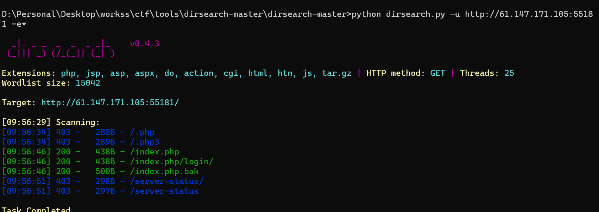

# web

## view_source

`X老师让小宁同学查看一个网页的源代码，但小宁同学发现鼠标右键好像不管用了。`

原理:浏览器开发者工具

目的:掌握查看源代码的方式

**步骤**

1. 用firefox打开页面，摁下F12，打开查看器可以得到flag

2. 或用chrome打开页面，摁下F12，在Elements栏可以得到flag

## get_post

`X老师告诉小宁同学HTTP通常使用两种请求方法，你知道是哪两种吗？`

**GET**和**POST**。

1. **GET**：
   - **用途**：用于从服务器获取资源。它是HTTP中最常见的请求方法之一。
   - **特点**：
     - 请求参数会附加在URL中，例如`https://example.com?param1=value1&param2=value2`。
     - 请求是幂等的，即多次请求相同资源的结果是一样的。
     - 由于参数在URL中，GET请求的长度有限制，通常不适合传输大量数据。
     - GET请求可以被缓存，也可以保留在浏览器历史记录中。

2. **POST**：
   - **用途**：用于向服务器提交数据，例如提交表单数据或上传文件。
   - **特点**：
     - 请求参数通常包含在请求体中，不会显示在URL中。
     - POST请求不是幂等的，多次提交相同的数据可能会导致不同的结果（例如多次提交订单）。
     - 可以传输大量数据，因为请求体的大小通常不受限制。
     - POST请求不会被缓存，也不会保留在浏览器历史记录中。
     - hackbar

这两种方法各有用途和特点，开发者会根据具体需求选择合适的请求方法。

## robots 协议

`X老师上课讲了Robots协议，小宁同学却上课打了瞌睡，赶紧来教教小宁Robots协议是什么吧。`

robots协议也叫robots.txt（统一小写）是一种存放于网站根目录下的ASCII编码的文本文件，它通常告诉网络搜索引擎的漫游器（又称网络蜘蛛），此网站中的哪些内容是不应被搜索引擎的漫游器获取的，哪些是可以被漫游器获取的。因为一些系统中的URL是大小写敏感的，所以robots.txt的文件名应统一为小写。robots.txt应放置于网站的根目录下。如果想单独定义搜索引擎的漫游器访问子目录时的行为，那么可以将自定的设置合并到根目录下的robots.txt，或者使用robots元数据（Metadata，又称元数据）。

robots协议并不是一个规范，而只是约定俗成的，所以并不能保证网站的隐私。

**一、定义**

Robots协议（也称为爬虫协议、机器人协议等），正式名称是“网络爬虫排除标准”（Robots Exclusion Protocol）。它是一个由网站所有者用来告诉网络爬虫（如搜索引擎爬虫）哪些页面或文件可以被爬取，哪些不可以被爬取的协议。它通常是一个名为“robots.txt”的文本文件，放置在网站的根目录下。

**二、作用**

1. **保护隐私信息**
   - 网站中可能包含一些敏感信息页面，例如用户个人信息页面、内部管理页面等。通过设置Robots协议，可以禁止爬虫访问这些页面，从而防止这些隐私信息被搜索引擎收录和公开。
   - 例如，一个电商网站可能有用户订单详情页面，这些页面包含用户的购买记录、收货地址等隐私信息。通过在robots.txt文件中指定禁止爬取这些页面的路径，可以避免这些信息被搜索引擎爬取。
2. **节省服务器资源**
   - 网络爬虫在爬取网站内容时会向服务器发送大量的请求。如果网站内容较多，爬虫无限制地爬取会占用大量的服务器带宽和服务器处理能力。通过Robots协议，网站可以引导爬虫只爬取重要的页面，从而减少服务器的负担。
   - 比如一个大型的新闻网站，它有大量的新闻文章页面和一些静态的图片资源页面。如果爬虫频繁地爬取图片资源页面，可能会导致服务器响应缓慢。通过设置Robots协议，让爬虫主要爬取新闻文章页面，就可以合理利用服务器资源。
3. **优化网站内容收录**
   - 网站所有者可以利用Robots协议引导搜索引擎爬虫优先爬取重要的内容页面。这对于网站的搜索引擎优化（SEO）是有帮助的。例如，一个企业网站可以设置让爬虫优先爬取产品介绍页面、公司介绍页面等核心内容页面，而忽略一些重复的、不重要的页面，如一些自动生成的分页页面或者一些临时的测试页面。
   - 这样可以提高网站核心内容在搜索引擎中的收录质量和权重，使得用户在搜索相关关键词时更容易找到网站的核心内容。

**三、基本语法**

1. **User - agent指令**
   - 这是Robots协议中用于指定爬虫的名称的指令。它可以是一个具体的爬虫名称，如“Googlebot”（谷歌搜索引擎爬虫），也可以是“*”（表示所有爬虫）。
   - 例如：
     - `User-agent: Googlebot`：这条指令是针对谷歌搜索引擎爬虫的。
     - `User-agent: *`：这条指令是针对所有爬虫的。
2. **Disallow指令**
   - 用于指定禁止爬取的路径。路径可以是网站的某个目录或者某个具体的页面。
   - 例如：
     - `Disallow: /admin/`：表示禁止爬取网站根目录下的“admin”目录。如果网站的URL是`http://www.example.com`，那么`http://www.example.com/admin/`目录下的所有页面都不会被爬取。
     - `Disallow: /private.html`：表示禁止爬取网站根目录下的“private.html”页面。
3. **Allow指令（可选）**
   - 用于允许爬取某些被Disallow指令禁止的路径。这在有些复杂的目录结构下很有用。
   - 例如：
     - `Disallow: /images/`：禁止爬取“images”目录。
     - `Allow: /images/logo.png`：允许爬取“images”目录下的“logo.png”图片文件。这样可以精确地控制爬虫的爬取行为。

**四、局限性**

1. **依赖爬虫遵守协议**
   - Robots协议是一种基于“君子协议”的规则。它依赖于爬虫开发者自觉遵守。恶意爬虫可能会忽略robots.txt文件中的指令，依然爬取被禁止的内容。例如，一些恶意的爬虫可能会爬取网站的隐私信息页面，用于非法目的。
2. **不能完全控制爬取行为**
   - 对于一些动态生成的网页内容，Robots协议可能无法完全精确地控制爬虫的爬取。因为动态页面的URL可能会随着参数的变化而变化，爬虫可能会误爬一些不应该爬取的内容，或者遗漏一些应该爬取的内容。

`dirsearch的命令必须在C:\Python3\Dirsearch\dirsearch-master目录下运行`

## backup

`X老师忘记删除备份文件，他派小宁同学去把备份文件找出来,一起来帮小宁同学吧！`

打开后发现：你知道index.php的备份文件名吗？

用dirsearch扫描，有

下载bak得到结果

`index.php` 的备份文件名并没有固定的标准，备份文件名通常由用户根据自己的习惯来命名。以下是一些常见的备份文件命名方式：

 1. **添加时间戳**
   - **格式**：`index.php_YYYYMMDD_HHMMSS` 或 `index.php.YYYY-MM-DD_HH-MM-SS`
   - **示例**：
     - `index.php_20250408_153000`
     - `index.php.2025-04-08_15-30-00`
   - **优点**：可以清晰地知道备份文件的具体时间，方便管理和查找。

 2. **添加版本号**
   - **格式**：`index.php_v1.0` 或 `index.php_v20250408`
   - **示例**：
     - `index.php_v1.0`
     - `index.php_v20250408`
   - **优点**：如果文件有多个版本，版本号可以帮助区分。

 3. **添加“backup”后缀**
   - **格式**：`index.php_backup` 或 `index.php.bak`
   - **示例**：
     - `index.php_backup`
     - `index.php.bak`
   - **优点**：简单明了，容易识别这是一个备份文件。

 4. **添加环境标识**
   - **格式**：`index.php_dev_backup` 或 `index.php_prod_backup`
   - **示例**：
     - `index.php_dev_backup`（开发环境备份）
     - `index.php_prod_backup`（生产环境备份）
   - **优点**：如果备份文件来自不同的环境，可以快速区分。

 5. **压缩文件形式**
   - **格式**：`index.php_YYYYMMDD.tar.gz` 或 `index.php_backup.zip`
   - **示例**：
     - `index.php_20250408.tar.gz`
     - `index.php_backup.zip`
   - **优点**：如果备份文件较大，压缩可以节省存储空间。

 6. **自定义命名规则**
   - **格式**：`backup_index.php_YYYYMMDD` 或 `index_backup_YYYYMMDD.php`
   - **示例**：
     - `backup_index.php_20250408`
     - `index_backup_20250408.php`
   - **优点**：可以根据个人喜好或团队规范来命名。

 **常见的备份文件名示例**
- `index.php_backup_20250408`
- `index.php_20250408.bak`
- `index.php_v1.0_backup`
- `index.php_prod_20250408.tar.gz`

**注意事项**
1. **备份文件的存储位置**：备份文件应该存储在安全的位置，避免被误删或覆盖。
2. **备份文件的权限**：确保备份文件的权限设置正确，避免被未经授权的用户访问。
3. **备份文件的测试**：定期测试备份文件的完整性和可恢复性，确保在需要时能够顺利恢复。
